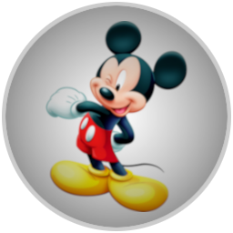

## Custom icons 

| Name          |  Image                                          | Windows icon
|:------------- | :---------------------------------------------: | :-------------------------------------:
| Ace Of Snakes |    | 
| AvrPioRemote  |    | 
| Msys2         |                  | 
| MTK           |                      | 
| MtkFwTool     |          | 
| MTKPio        |                | 
| MTK ReMaker   |              | 
| Mickey        |                | 
| NetRC         |                  | 
| Заёбушек      |           | 

## Putty 256x256 Windows icons 
[putty](./putty/)

