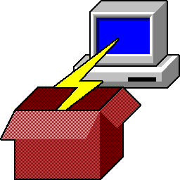

## Putty Windows 256x256.icons

| Name          |  Image                            | Windows icon
|:------------- | :-------------------------------: | :------------------------:
| pagent        |     | 
| pscp          |         | 
| pterm         |        | 
| ptermcfg      |  | 
| putty         |        | 
| puttycfg      |  | 
| puttygen      |  | 
| puttyins      |  | 