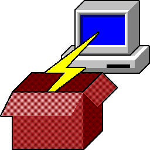

## Putty Windows 256x256.icons

| Name          |  Image                         | Windows icon
|:------------- | :----------------------------: | :------------------------:
| pagent        |        | 
| pscp          |             | 
| pterm         |           | 
| ptermcfg      |     | 
| putty         |           | 
| puttycfg      |     | 
| puttygen      |     | 
| puttyins      |     | 